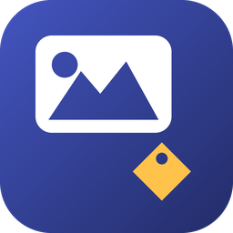

# MyStockManager

**Android app that turns a shoot into upload-ready stock photos.** It writes the title,
description and keywords into the JPEG itself, so the file you hand Adobe Stock or
Shutterstock already carries its metadata.

<br clear="left">

## What it does

- **Organises shoots into events** - one event per shoot, day or theme.
- **Imports straight into the album.** Picked images are copied to
  `Pictures/StockReady/StockReady - <event>/`, visible in your gallery and in every upload
  picker immediately. Your camera roll is never touched, and there is no second private copy
  to drift out of sync.
- **Generates metadata with OpenAI vision** - title, description, up to 49 relevance-ordered
  keywords, and a category. You can add a location, which the model cannot infer from the
  pixels and which buyers search by.
- **Embeds it losslessly** into IPTC IIM (APP13) and XMP (APP1). Segments are spliced;
  pixels are never decoded or re-encoded.
- **Verifies every write.** The embedded copy is read back and compared before the album
  file is overwritten, so a failed embed can never damage an image you already have.
- **Lets you correct anything** - open an image to edit its title, description or category,
  and rename, reorder or remove an individual keyword. Saving rewrites the JPEG, not just
  the database.
- **Runs generation in the background**, one worker per image, so one failure retries on its
  own without holding up the batch.
- **Keeps your API key in EncryptedSharedPreferences**, Keystore-backed and excluded from
  backup.

## Uploading stays manual

MyStockManager never connects to Adobe Stock or Shutterstock. It has no agency login, stores no
agency credentials, and does not submit, schedule or automate uploads. Its only network call is
to the OpenAI API, for metadata.

All it prepares is files. Each event is its own folder under `Pictures/StockReady/`, so when you
open an agency's upload form and add files, the system picker already shows that shoot grouped
together. You pick the images and submit them yourself. The title, description and keywords are
already embedded in each file, so it works like uploading photos you keyworded in Lightroom or
Bridge.

The photos are never generated or altered. A model only drafts the text, and you can edit every
field before it is written. It is still up to you to check that the text describes each image
accurately.

## Keyword limits

Adobe Stock caps keywords at 49, Shutterstock at 50 with a minimum of 7. The app clamps to
49 so one keyword set satisfies both, and warns below 7.

## Build

Requires an OpenAI API key, entered in Settings - none is bundled. Model is selectable
between `gpt-4o-mini` (default) and `gpt-4o`.

```bash
./gradlew installDebug
```

Kotlin · Jetpack Compose · Room · Hilt · WorkManager · Commons Imaging + Adobe XMPCore ·
minSdk 29
