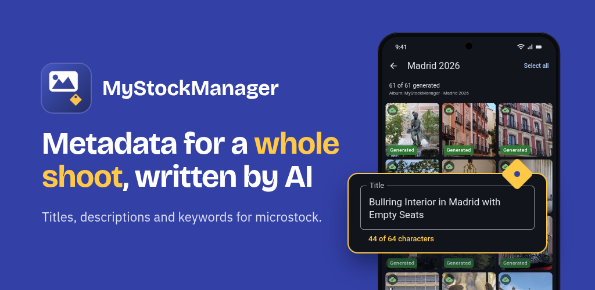
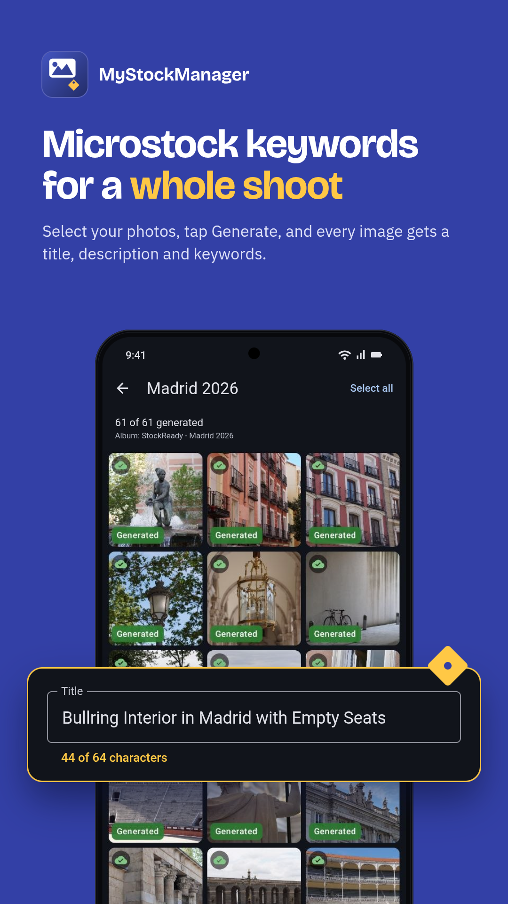
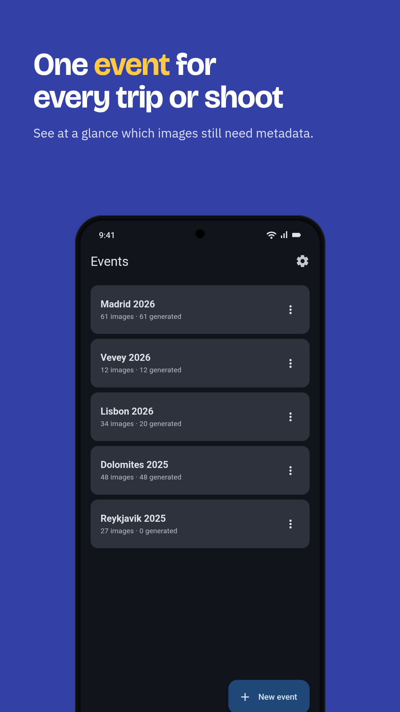
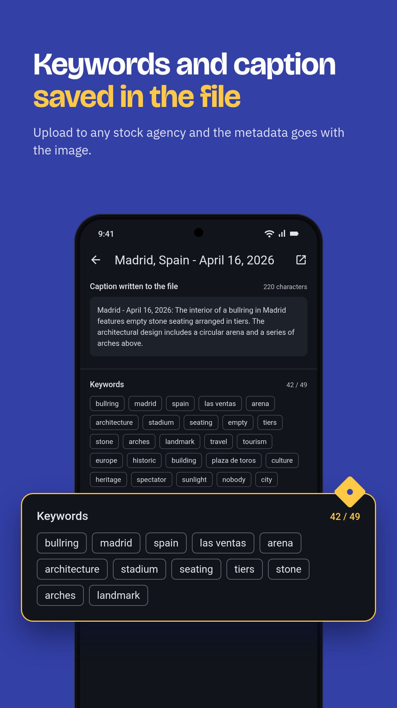
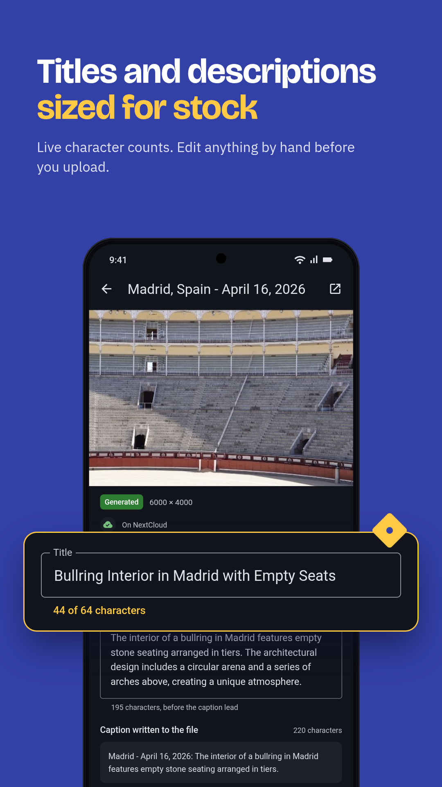
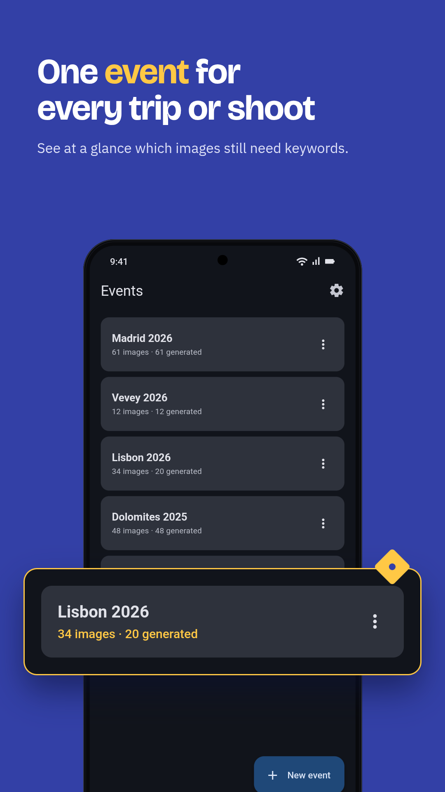
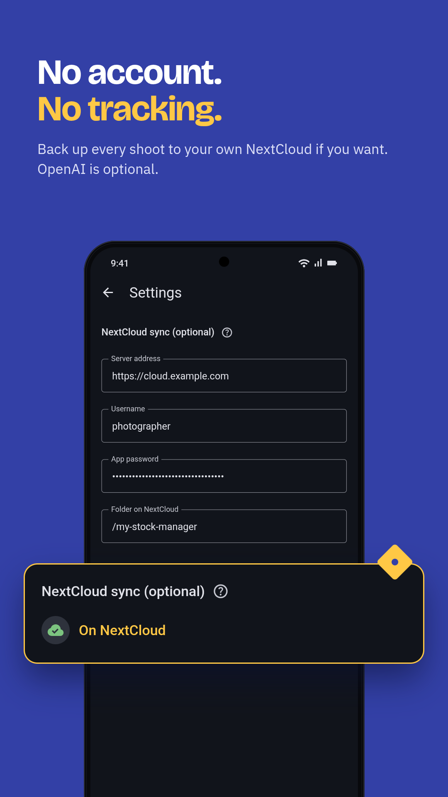

# MyStockManager

**Android app that turns a shoot into upload-ready stock photos.** It writes the title,
description and keywords into the JPEG itself, so the file you hand Adobe Stock or
Shutterstock already carries its metadata.

<a href="https://play.google.com/store/apps/details?id=com.mrlaki5.mystockmanager"></a>

<p>
  
  
  
  
  
  
</p>

## What it does

- **Organises shoots into events** - one event per shoot, day or theme.
- **Imports straight into the album.** Picked images are copied to
  `Pictures/StockReady/StockReady - <event>/`, visible in your gallery and in every upload
  picker immediately. Your camera roll is never touched, and there is no second private copy
  to drift out of sync.
- **Generates metadata with OpenAI vision, or on the phone itself** - title, description,
  relevance-ordered keywords, and a category. An optional hint adds what the model cannot see
  in the pixels, such as the place, subject or event; with OpenAI, a place it names leads the
  caption. The on-device option needs no API key, costs nothing, and the photo never leaves
  the phone; see [On-device generation](#on-device-generation).
- **Embeds it losslessly** into IPTC IIM (APP13) and XMP (APP1). Segments are spliced;
  pixels are never decoded or re-encoded.
- **Verifies every write.** The embedded copy is read back and compared before the album
  file is overwritten, so a failed embed can never damage an image you already have.
- **Lets you write or correct anything by hand** - open an image to edit its title,
  description or category, and rename, reorder or remove an individual keyword. An image with
  no metadata yet gets the same editor, so you can write it yourself instead of generating it.
  Saving rewrites the JPEG, not just the database.
- **Runs generation in the background**, one worker per image, so one failure retries on its
  own without holding up the batch.
- **Optionally syncs every event to NextCloud** - one folder per event under a path you
  choose (`/my-stock-manager` by default). New and re-keyworded images are uploaded, renames
  move the folder, and deletions made while sync is on are deleted on the cloud too. It is
  one-way, Wi-Fi only by default, and never touches files it did not upload itself.
- **Pulls everything back from NextCloud on request** - after reinstalling, or on a new
  phone, one tap downloads every event and image, with its title, description and keywords
  read back out of the file. It never deletes anything on the phone.
- **Keeps your API key and NextCloud app password in EncryptedSharedPreferences**,
  Keystore-backed and excluded from backup.

## Uploading stays manual

MyStockManager never connects to Adobe Stock or Shutterstock. It has no agency login, stores no
agency credentials, and does not submit, schedule or automate uploads. It talks to the OpenAI API,
for metadata, unless you generate on the device; to Hugging Face, once, if you download the
on-device model; and, only if you set up sync, to your own NextCloud server, as a backup copy of
your events.

All it prepares is files. Each event is its own folder under `Pictures/StockReady/`, so when you
open an agency's upload form and add files, the system picker already shows that shoot grouped
together. You pick the images and submit them yourself. The title, description and keywords are
already embedded in each file, so it works like uploading photos you keyworded in Lightroom or
Bridge.

The photos are never generated or altered. A model only drafts the text, or you write it
yourself, and you can edit every field before it is written. It is still up to you to check
that the text describes each image accurately.

## Keyword limits

Adobe Stock caps keywords at 49, Shutterstock at 50 with a minimum of 7. The app clamps to
49 so one keyword set satisfies both, and warns below 7.

## On-device generation

One small model runs on the phone's CPU, about 15 seconds per image on a mid-range phone
(the first image of a batch also loads the model, a few seconds more):
[LFM2.5-VL-450M](https://huggingface.co/litert-community/LFM2.5-VL-450M) by Liquid AI, run with
[LiteRT-LM](https://github.com/google-ai-edge/LiteRT-LM). It is under the
[LFM Open License v1.0](https://huggingface.co/LiquidAI/LFM2.5-VL-450M/blob/main/LICENSE),
which is free to use, including commercially, below USD 10 million in annual revenue.

Everything happens in one conversation about the photo, so the image is encoded only once. The
model writes the description as a one-sentence stock caption, then the title, then answers one
short question per keyword (main subject, other objects, setting, colour, light and so on) until
it has 10 keywords, then picks a Shutterstock category from the fixed list. The app strips any
talk about the photo itself ("The image shows...") and filler praise ("stunning", "serene") from
the caption, so it only says what is in the picture. Asked for a whole keyword list, or for "one
more keyword" again and again, a model this small starts repeating itself after a few words;
one narrow question at a time avoids that. Hint terms come first in the keyword list.

The file (0.4 GB) is downloaded over Wi-Fi from Hugging Face when you ask for it in Settings,
pinned to a fixed revision and checked against its SHA-256. The text is simpler than OpenAI's,
and the editable system prompt applies to OpenAI only.

## Build

Generation uses either an OpenAI API key, entered in Settings - none is bundled - or the
on-device model. Model is selectable between `gpt-6-luna` (default) and `gpt-6.1-sol`, with a
reasoning effort level. Without either, everything else works and metadata can be written by
hand.

The app is built for arm64-v8a only, the ABI the on-device runtimes ship for.

```bash
./gradlew installDebug
```

Kotlin · Jetpack Compose · Room · Hilt · WorkManager · Commons Imaging + Adobe XMPCore ·
minSdk 29

## Release

Release builds are signed with an upload key that is never committed. Google Play re-signs
the app with its own app-signing key.

**One-time setup.** Create the upload key in the gitignored `keys/` folder, and back it up
outside the repo together with its password. Without it you cannot publish updates.

```bash
mkdir -p keys
keytool -genkeypair -v -keystore keys/mystockmanager-upload.jks \
  -alias upload -keyalg RSA -keysize 4096 -validity 10000
cp keystore.properties.example keystore.properties   # then fill in the password twice
```

**Local build:** `./gradlew bundleRelease` writes `app/build/outputs/bundle/release/app-release.aab`,
which is the file you upload to Play. Without `keystore.properties` the build is produced
unsigned.

**CI build:** pushing a tag equal to `versionName` (a leading `v` is allowed) builds a signed
AAB and APK and attaches both to a GitHub release. Add these repository secrets first:

| Secret | Value |
|---|---|
| `RELEASE_KEYSTORE_BASE64` | `base64 -w0 keys/mystockmanager-upload.jks` |
| `RELEASE_STORE_PASSWORD` | keystore password, only the password itself |
| `RELEASE_KEY_ALIAS` | `upload` |
| `RELEASE_KEY_PASSWORD` | the same password (PKCS12 keys share it) |

Before each release, bump both `versionCode` (Play rejects a code it has seen before) and
`versionName` in `app/build.gradle.kts`.
